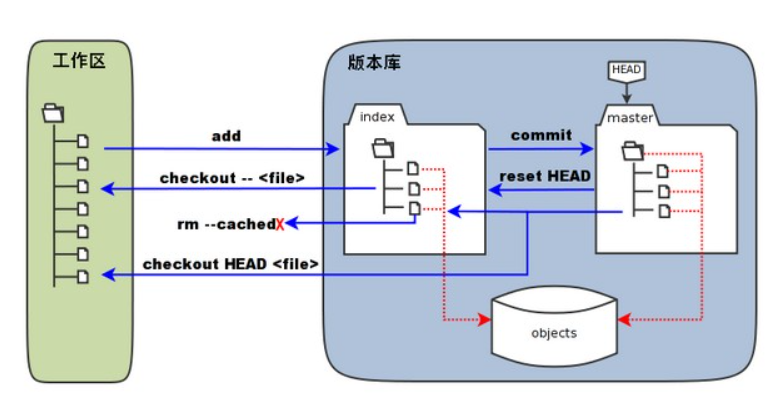
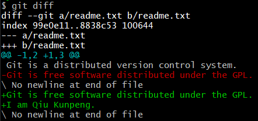
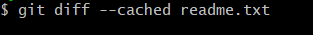
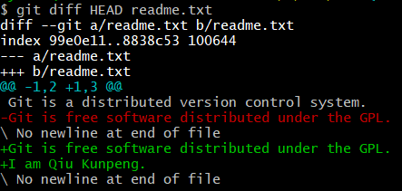
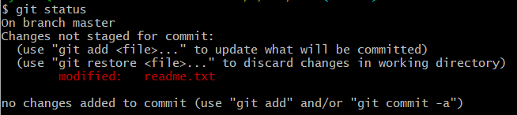

<!--
 * @Author: your name
 * @Date: 2021-01-19 14:31:58
 * @LastEditTime: 2021-01-21 12:49:58
 * @LastEditors: Please set LastEditors
 * @Description: This blog is used to recording the learning process of Git Instruction.
 * @FilePath: \Git Instruction\Git Instruction.md
-->

# Git Instruction
## Why Git?
Git is wrote by Linus, which is used as a Version Control System (VCS). Now is one of the most popular instruction in the world.
## Install Git on Windows
- Via this [link](https://git-scm.com/downloads), you can download the current version.
- Select the default configuration during installation.
- After you have installed, **Git Bash** can be found in Start.
## Create a new folder
- Before using the code, we have to create a new folder to organize all the codes.
- You can make the folder manually or by code. The code is shown below:
```C++
mkdir <folder>
```
## Set up Git
1. Before we set up **Git**, we have to know why?
- Remote repository can support two different protocol: **SSH** and **HTTPS**. **SSH** protocol only recognize machine and **HTTPS** protocol only recognize account. If we use **SSH** to control the repository remotely, we have to match the public key and private key. Else if we use **HTTPS**, the account and the key are needed to get the authority. Either **SSH** or **HTTPS** needs authority. However, the remote repository need to record who made this modification. Thus, we have to set **email** and **name** in local to indicate the editor.
2. We can enter the code below to set the **email** and **name**.
```
git config --global user.name "<name>"
git config --global user.email "<email>"
```
3. If you use **--global**, you only need to config the **name** and **email** for one time. Then the modification in local will always be recorded with this **name** and **email** you have configured. If you want to use different **name** and **email** for specify task, you should delete **--global**.
4. The reason why we need global **name** and **email** is that the key of **SSH** can be bound with different accounts. Thus we don't know who submit the material via **SSH**. However, we have to know who did it via **Git** in the remote repository. **name** and **email** can solve this problem.
5. The **name** and **email** in local have no difference to the authentication in remote repository. It means no authentication needed. If the **email** configured doesn't in **Git**, the records in commit will show your configured **name**. Thus we'd better use the true **name** and **email** in local.
6. If you have made the configurations, you can use the code below to check.
```
git config --global user.name
```
## The basic conception of Git
1. **Working Tree**: You can see it in the folder you created.
2. **Stage** or **Index**: After you entering the code below, you will see a hidden folder in the folder you created called **.git**. And the **Stage** or the **Index** is in the folder under **.git** called **index**.
```
git init
```
3. **Commit**: The hidden folder called **.git** is the **Commit**.
## The relationship between the basic conceptions
1. The left part of the image is **Working Tree** and the right part of the image is the **Index** part. The **master** is the name of the main branch.
2. The **HEAD** is a pointer of **master**. Thus, we can use **master** to replace **HEAD**.
3. **object** is under the hidden folder of **.git**, including all the created objects and index.
4. When the **Working Tree** changed and enter the code below, the **Index** will update. Meanwhile, the context of the document changed in the **Working Tree** will be written into **object** as a new object. And the **ID** of the object will be recorded in the **index**.
```
git add <document>
```
5. When enter the code blow, the object in the **index** be written into **Commit**. And the branch of **master** will update. The content pointed by the **HEAD** will be submitted into **Commit**.
```
git commit -m <document>
```
6. When enter the code blow, the content of the **index** will be replaced by the content pointed by the pointer. However, there is no difference to **Working Tree**.
```
git reset HEAD
```
7. When enter the code blow, the document will be deleted directly and there is no change to **Working Tree**.
```
git rm --cached <document>r
```
8. When enter the code-A blow, the documents in **index** will replace all the documents in **Working Tree**. The documents in **Working Tree** not added into **index** will be deleted.
<br>However, If you enter the code-B below, the specified document in **index** will replace the corresponding document in **Working Tree**.
```
<A> git checkout .


<B> git checkout --<document>
```
1. When enter the code-A blow, the documents pointed by the pointer **HEAD** in **master** will replace all the documents in **index** and **Working Tree**. The documents in **index** and **Working Tree** not committed into **Commit** will be deleted.
<br>However, If you enter the code-B below, the specified documents pointed by the pointer **HEAD** in **master** will replace all the documents in **index** and **Working Tree**.
```
<A> git checkout HEAD


<B> git checkout HEAD <document>
```
<center>

</center>


## Create Git repository
1. Cause you have created en empty folder, and used the code below to init the folder.
```
git init
```
2. Now you can create some documents in this folder. In this step, I recommend Notepad++ to create **.txt** documents. Cause the **.txt** document created by thr **Text document** in **Windows** always start with **Oxefbbbf** which is **Hexadecimal**. However, sometimes we have to use **GBK** to enter **Chinese**, **Text document** cannot be organized by **Git**.
3. If you have created an non empty **.txt** document, enter the code below, the document will be added into **index**. This means the **document** will be tracked.
```
git add <document>
```
4. And then, enter the code below, the document will be committed into **Commit**. The version which is added into **index** will be recorded into history (log).
```
git commit -m <document>
```
## The difference among **Working Tree**, **index** and **Commit**
1. Create one more different non empty **.txt** document in repository.
2. Enter the code below, the document will be added into **index**.
```
git add <document>
```
3. Then, change the document in **Working Tree** and directly enter the code below without adding it into **index** again.
```
git commit -m <document>
```
4. Enter the code below, you can check the context in the **modified** document. The context includes the sentence which is not added into **index**.
```
cat <document>
```
5. Enter the code below, you can find the difference between **Working Tree** and **index**. The result in the image below.
```
git diff
```
<center>

</center>

- The first line means there are two **documents** and they are all called **readme.txt**. **a** represents the original one and **b** is the modified one.
- The second line means the two **documents** are in **index** and the next numbers (99e0e11 and 8838c53) follow **index** are the **hash ID** of the **documents**. The last number (100644) represents authority.
- The third line and the fourth line represent the original material and the modified material. **-** means the original one and **+** means the modified one.
- The fifth line tells you the specify lines which has been modified. **-** also means the original one and **1** means the start line and **2** means offset 2 lines. The total number of lines is 2. The same as **+** and **1** means the start line and **3** means the offset lines. The total number of the modified document is 3.
- The red lines are the context of the original material and the green lines are the context which is different from the original one.
6. Enter the code below, you can find the difference between **index** and **commit**. The result in the image below.
```
git diff --cached <document>
```
<center>

</center>

There is no context in the image, thus we know there is ne difference between **index** and **commit**.


7. Enter the code below, you can find the difference between **Working Tree** and **commit**. The result in the image below.
```
git diff HEAD <document>
```
<center>

</center>

- The first line means there are two **documents** and they are all called **readme.txt**. **a** represents the original one and **b** is the modified one.
- The second line means the two **documents** are in **index** and the next numbers (99e0e11 and 8838c53) follow **index** are the **hash ID** of the **documents**. The last number (100644) represents authority.
- The third line and the fourth line represent the original material and the modified material. **-** means the original one and **+** means the modified one.
- The fifth line tells you the specify lines which has been modified. **-** also means the original one and **1** means the start line and **2** means offset 2 lines. The total number of lines is 2. The same as **+** and **1** means the start line and **3** means the offset lines. The total number of the modified document is 3.
- The red lines are the context of the original material and the green lines are the context which is different from the original one.
8. Summary of the relationship:

- Actually, **Git** only temporarily store the version after entering the code below. The context you modified latter is only in **Working Tree**. Thus, the code below exactly store the specific context not the whole document.
```
git add <document>
```
## The status of the documents
1. Enter the code below, you can get the status of all the documents in the local repository.
```
git status
```
If the status tells you **nothing to commit, working tree clearn**, it means all the contexts in the **documents** have been tracked. Else if the status shows below:
<center>

</center>

- The first line indicates the default branch called **master**.
- The second line indicates the document has been added into **index** before, however some modifications made and the new one is not added into **index** again.
