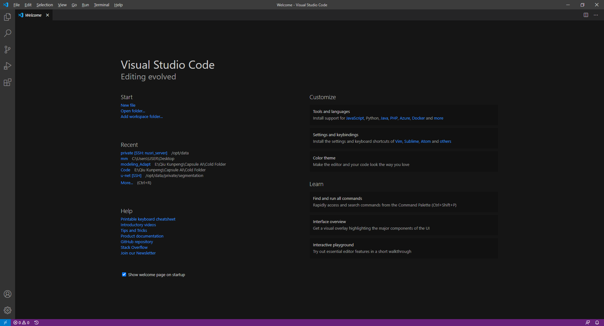
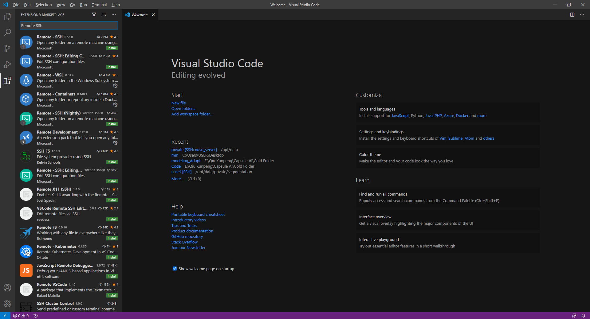
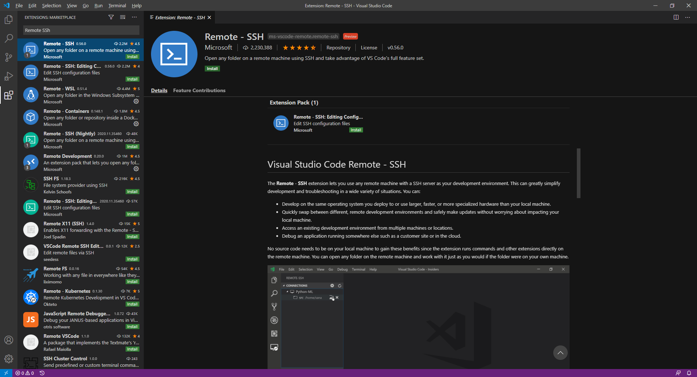
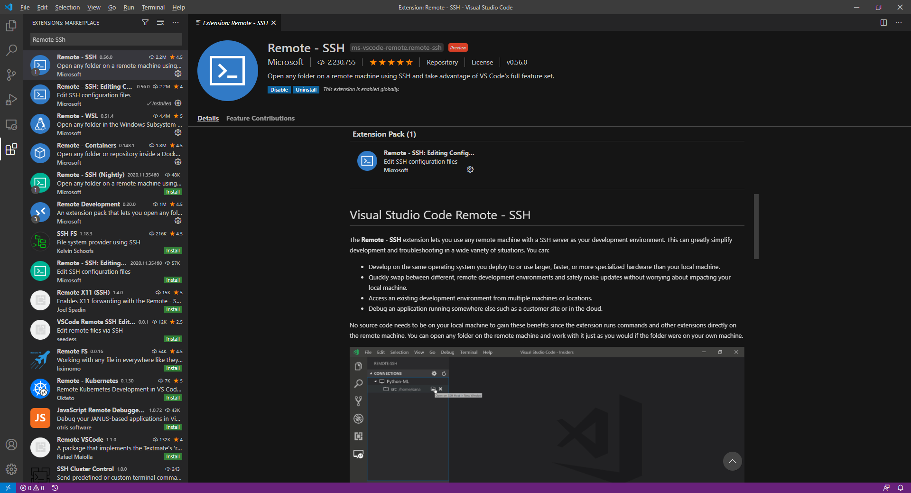
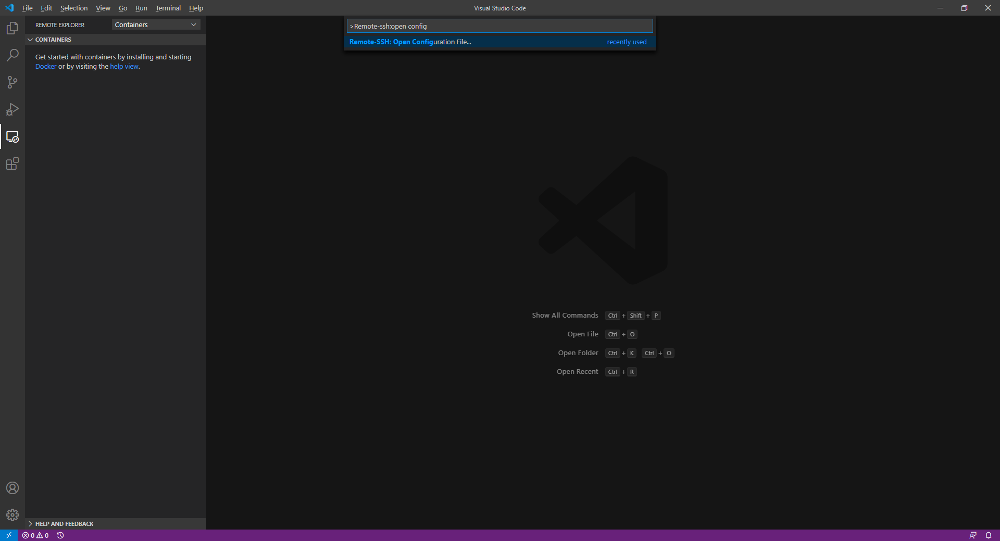
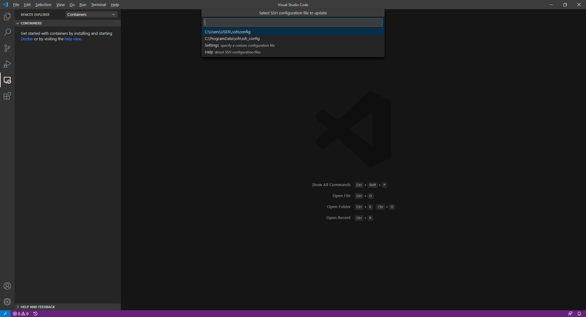
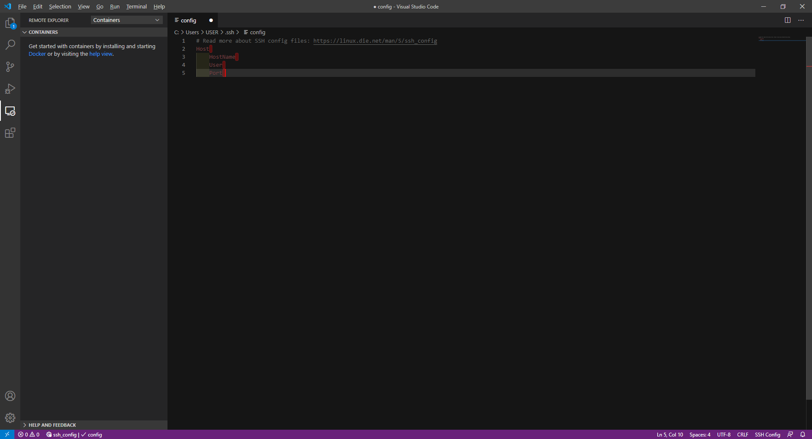
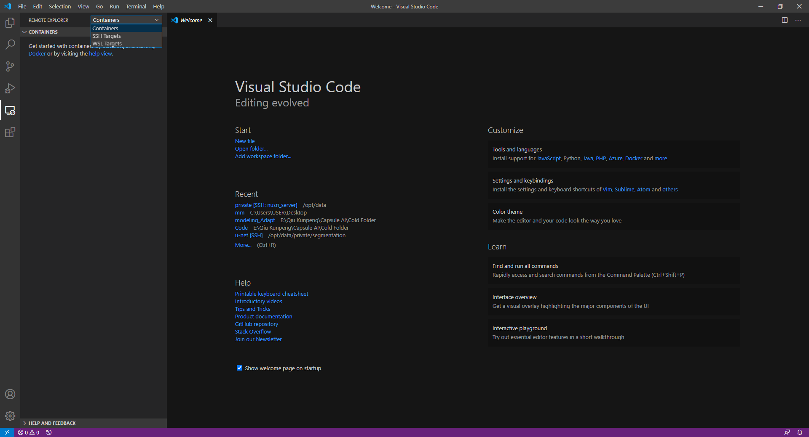

# 如何在使用VScode时轻松从本地连接到服务器(*Ubuntu*)上？

1. 首先你需要保证你的电脑和服务器处于同一个局域网，若不在同一个局域网则需要挂***vpn***！
2. 当你的电脑和服务器处于同一局域网时，你可以开始配置*VScode*了！
   - 打开*VScode*：
   
   
   
   在左边的*Bar*中，找到第五个图标(*Extensions*)点击进入(快捷键打开方式：*Ctrl+Shift+X*)
   
   - 进入*Extensions*：
   
   
   
   - 查找*Remote - SSH*：
   
   
   
   点击*Install*安装
   
   - 安装完后左侧的Bar中会出现一个新的小电脑图标(*Remote Explorer*)：
   
   
   
   如果安装完后并未出现，可能是被隐藏了，你只需要右击左侧的Bar区域，将*Remote Explorer*这个插件前打上小勾勾即可
  
   - 现在我们需要配置*Config*文件了
   
   在VScode中用快捷键(*Ctrl+Shift+P*)打开命令行，输入*Remote-SSH：Opne Config*，系统将会显示完整命令行
   
   
   
   - 点击后会显示你的*.ssh/config*路径，继续点击进入
   
   
   
   - 现在我们可以看到你需要配置的内容了
   
   
   
   ***Host：*** 你可以任意修改，不会对连接服务器有任何影响
   
   ***HostName：*** 你需要输入服务器的*ip*地址，格式为**XX.XX.XX.XX**
   
   ***User：*** 你需要输入对应的服务器中*docker*的用户名
   
   ***Port：*** 你需要输入服务器所在端口 **(注意，端口每次删除docker会变化，因此一旦新建或重建docker则一定需要修改Port)**
   
   如果没有出现***Port：***， 你可以回车到下一行自己手动输入
   
   - 配置完后点击*Remote Explorer*图标，如果没有出现服务器，你需要选择上方REMOTE EXPLORER 右侧的下拉选择框内的SSH Targets
   
   
   
   现在你可以看到你的服务器啦！
   
   - 选择你要链接的服务器，鼠标右击连接，输入密码即可！
