# 如何用Tensorboard在本地查看服务器(*Ubuntu*)上模型训练的过程？

***(注：本教程基于Xshell终端模拟器)***

1. 首先你需要保证你的电脑和服务器处于同一个局域网，若不在同一个局域网则需要挂 ***vpn*** ！
    - 此链接可以下载[*Xshell*](https://www.netsarang.com/zh/xshell/)

2. 其次，需要保证你的服务器中已经安装了*tensorflow*， *tensorflow-gpu*, *tensorboard*

3. 当你的电脑和服务器处于同一局域网时，可以开始配置*Xshell*了！
    - 打开*Xshell*
    
    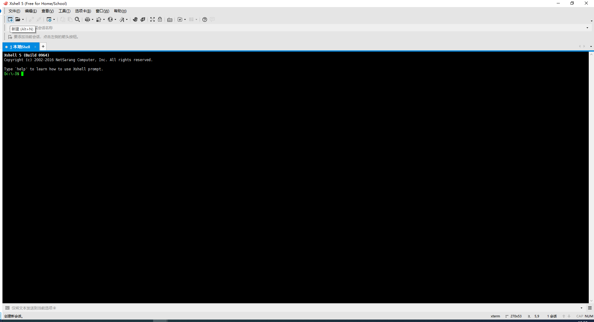
    
    点击左上角第二行第一个的 ***新建图标*** ，会跳出新建会话属性窗口。
    
    - 设置会话属性
    
    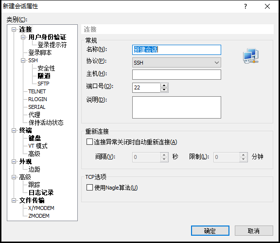
    
    ***名称：*** 输入你喜欢的任意名称 **(注：如果该名称已被使用，则不可以再使用)**
    
    ***协议：*** 不需要更换，就用***SSH***
    
    ***主机：*** 填写你所要连接的服务器的ip地址
    
    ***端口号：*** 填写你所要连接的服务器的端口
    
    - 设置完的会话属性
    
    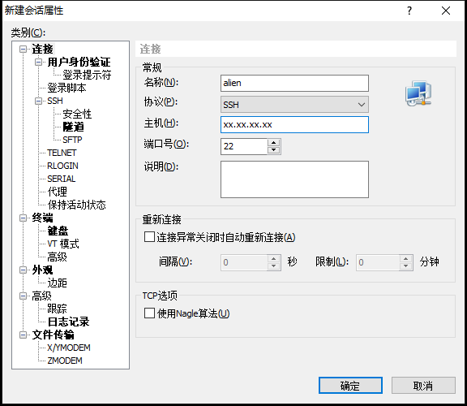
    
    剩下的可以暂不填写，点击 ***确定***，你会跳回到*Xshell*的主界面，并成功创建会话 **(注：如果没显示，可以点击*Xshell*左上角 ***文件*** ***打开***)**
    
    - 会话窗口
    
    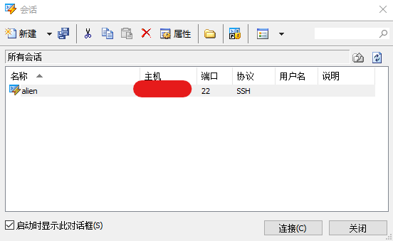
    
    选中你创建的名称 **(注：因为名称不能重复，因此不用担心选错)** 右击，选择 ***属性***
    
    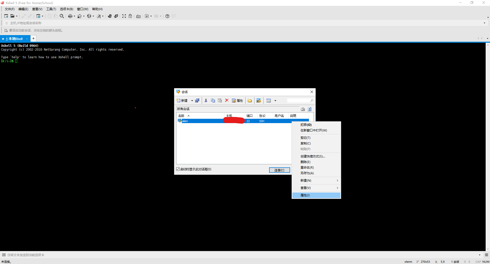
    
    - 设置该账户(名称)下的属性
    
    选择 ***隧道***
    
    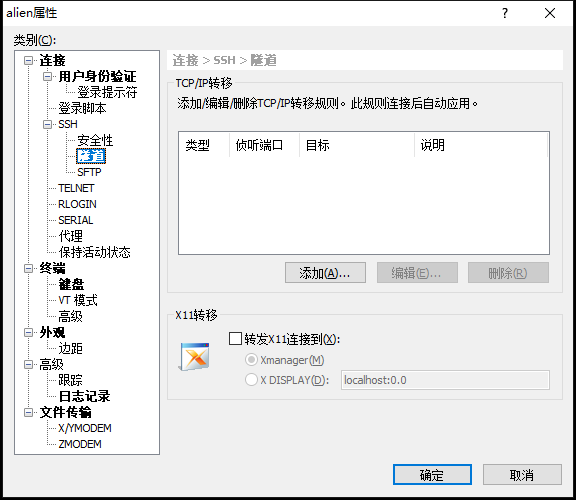
    
    点击 ***添加*** 会跳出 ***转移规则*** 对话框
    
    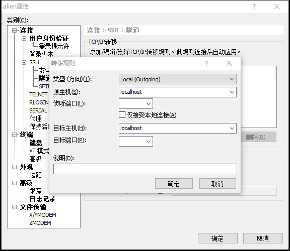
    
    我们只要设置 ***侦听端口*** 和 ***目标端口*** ，且只要保证两端口一样即可，例如我设置的为 ***6006***
    
    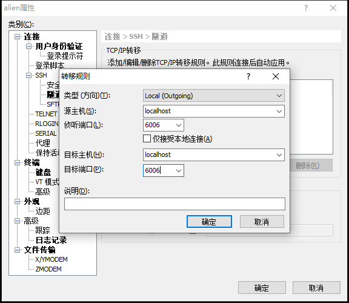
    
    设置完成后点击 ***确定*** ，再点击 ***用户身份验证*** 
    
    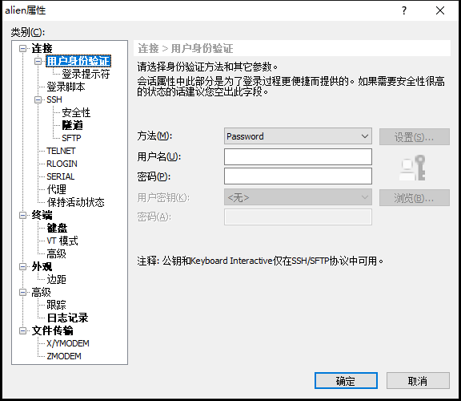
    
    该窗口中，我们设置好连接服务器时需要输入的 ***用户名*** 和 ***密码*** ，点击 ***确定***。
    
    - 为了能用*tensorboard*查看训练过程，需要首先知道我们的文件路径
    
    因为我使用的是*FileZilla*这款*FTP*客户端，因此可以查看文件路径
    
    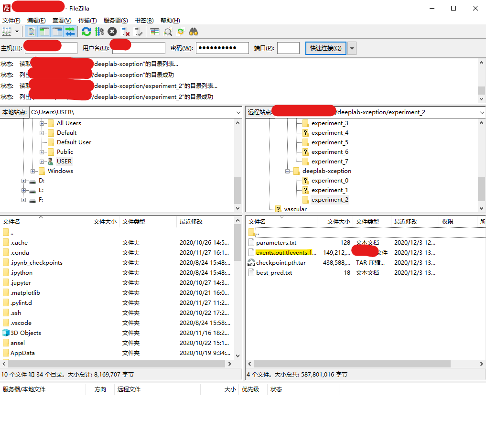
    
    黄色标记的就是我们的目标文件
    
    - 因此，我们首先需要找到该文件的主路径
    
    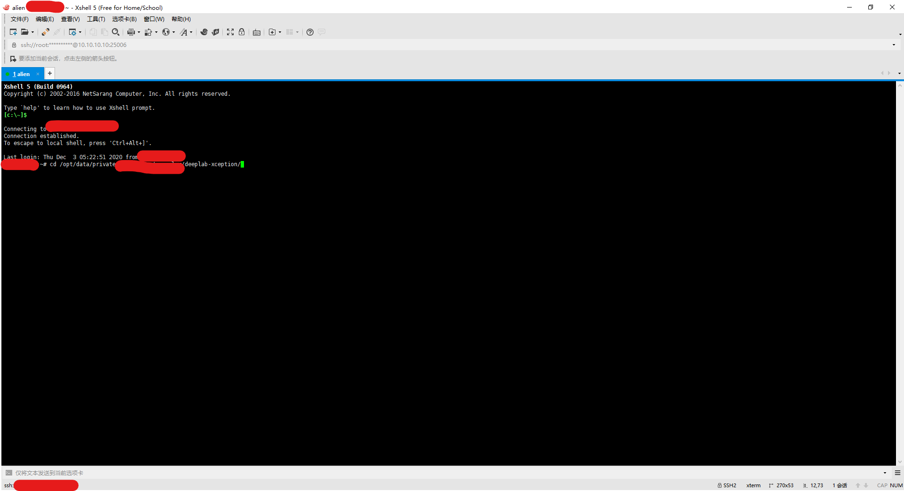
    
    在*Xshell*中，我们已经连接了服务器，因此可以利用指令 ***cd*** 找到目标文件所在文件夹的上一层
    
    - 现在，我们可以用使用
    
    ```python
    tensorboard --logdir=./目标文件所在文件夹 --port=6006
    ```
    
    其中 ***prot*** 对应的值就是你输入***侦听端口*** 和 ***目标端口***的值
    
    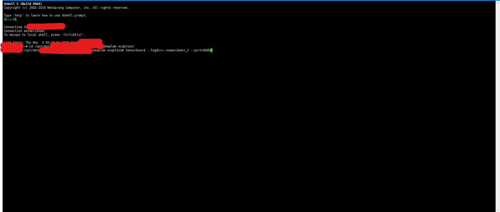
    
    按下回车键，若显示如下图，蓝色部分就表示成功连接了
    
    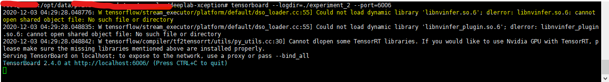
    
    (注：黄色部分可以通过重新匹配*GPU*的***CUDA/cuDNN/tensorflow版本***去除)
    
    - 现在，你可以在你本地电脑上的浏览器中，输入
    
    ```
    localhost：6006
    ```
    
    即可看到你的训练过程！
    
    
    
